## Table of contents
* [General info](#general-info)
* [Project assumptions](#project-assumptions)
* [Application idea](#application-idea)
* [Technologies](#technologies)
* [Status](#status)
* [Screenshots](#screenshots)
* [Setup](#setup)

## General info
This project is a website of a beauty salon with the possibility of registering a client for cosmetic treatments.

## Project assumptions
* Use SQL Database to storage the data
* Use Spring Boot
* Use Spring Security
* Use Spring MVC
* Use Hibernate
* Use JUnit 5

## Application idea
* Every client can create the account 
* Every client must verify the email address
* Every client can perform operations such as booking or cancelling a visit for cosmetic treatment
* Before booking a visit, every client must complete the form, which is necessary for the person who will perform the cosmetic treatment
* Every client can check the current visits and the entire history of their visits
* Only the administrator can get information about clients
* Only the administrator can manage treatments such as adding new, updating or deleting

## Technologies
Project is created with:
* Java 8
* Maven 3
* Spring Boot 2
* Spring Security
* Spring MVC
* Hibernate
* JUnit 5
* Thymeleaf
* HTML5
* CSS
* Tomcat

## Status
In the future, the application will be used by a beauty salon. 
The appearance of the website will be changed and new features will be added.

## Screenshots
#### Main website
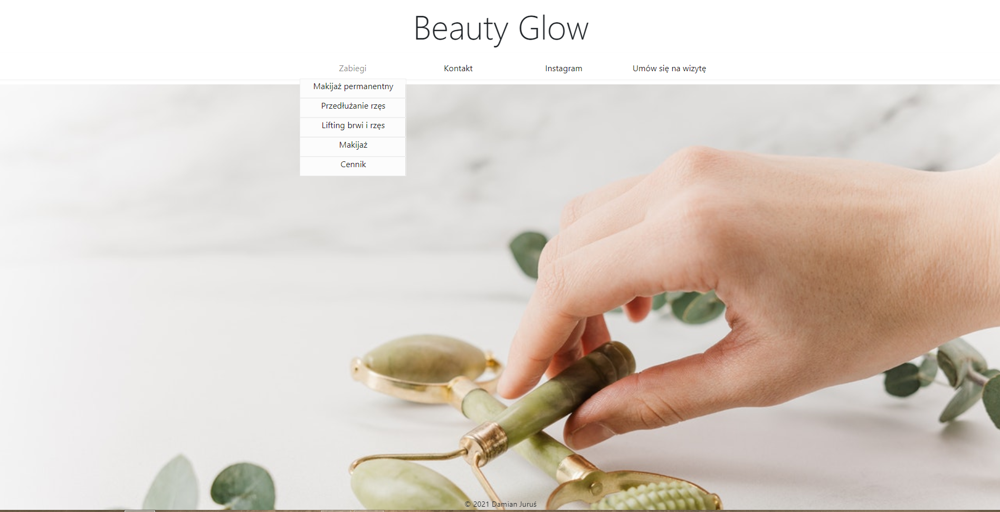
#### Login form
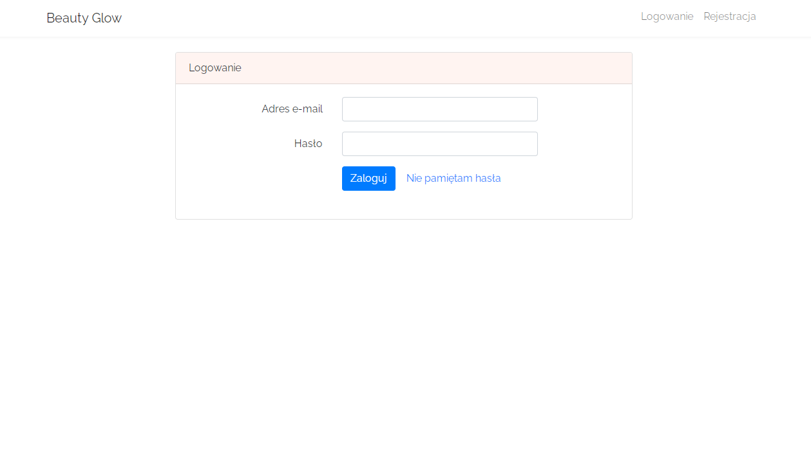
#### Registration form
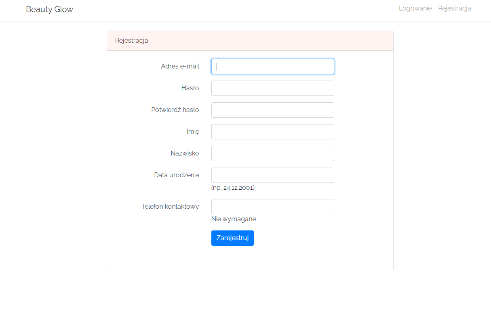
#### Account information
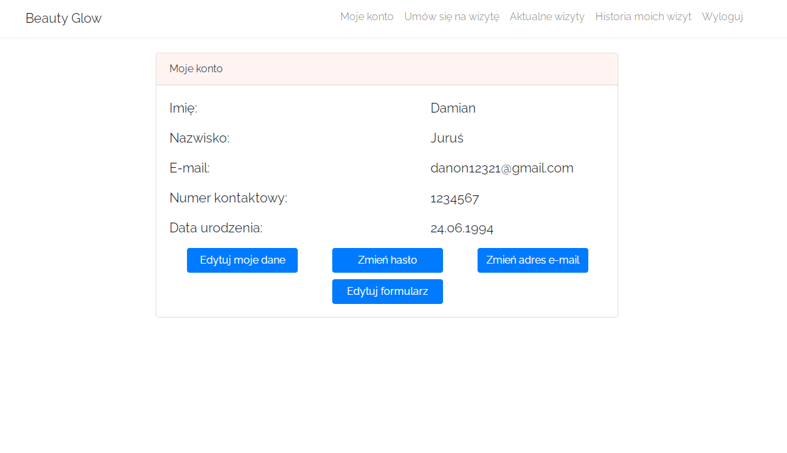
#### User form
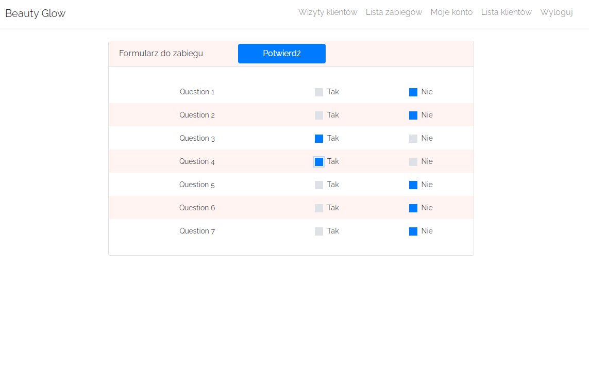
#### Treatment selection
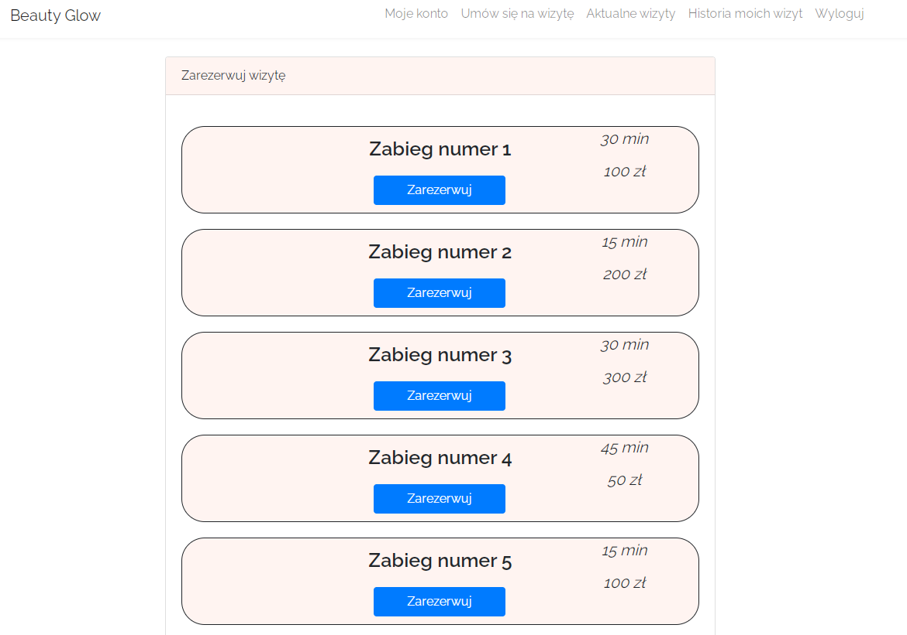
#### Actual visits
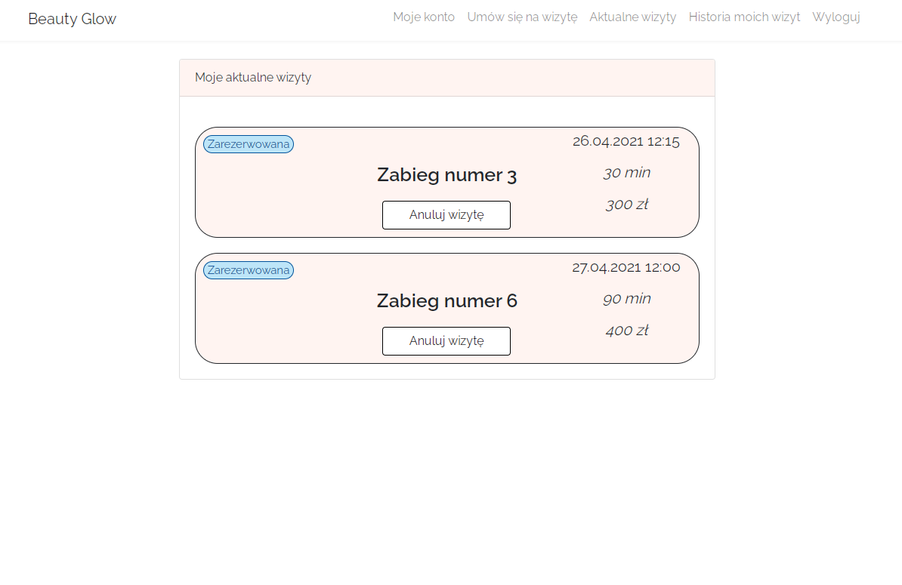
#### Visit history
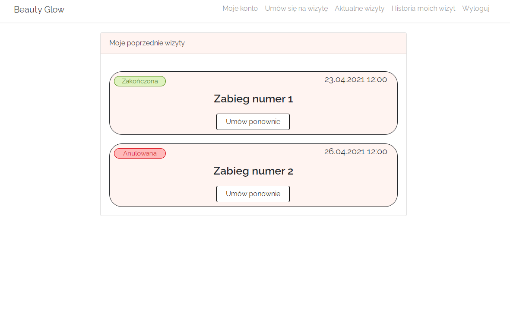
#### Book a new visit
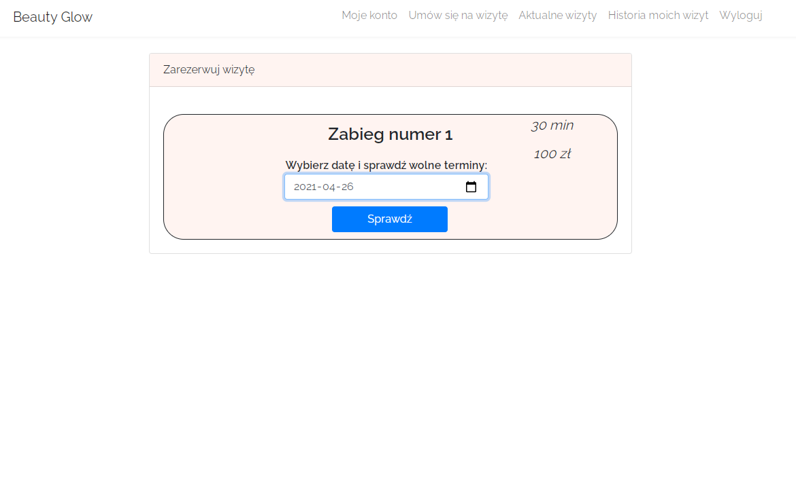
#### Available hours
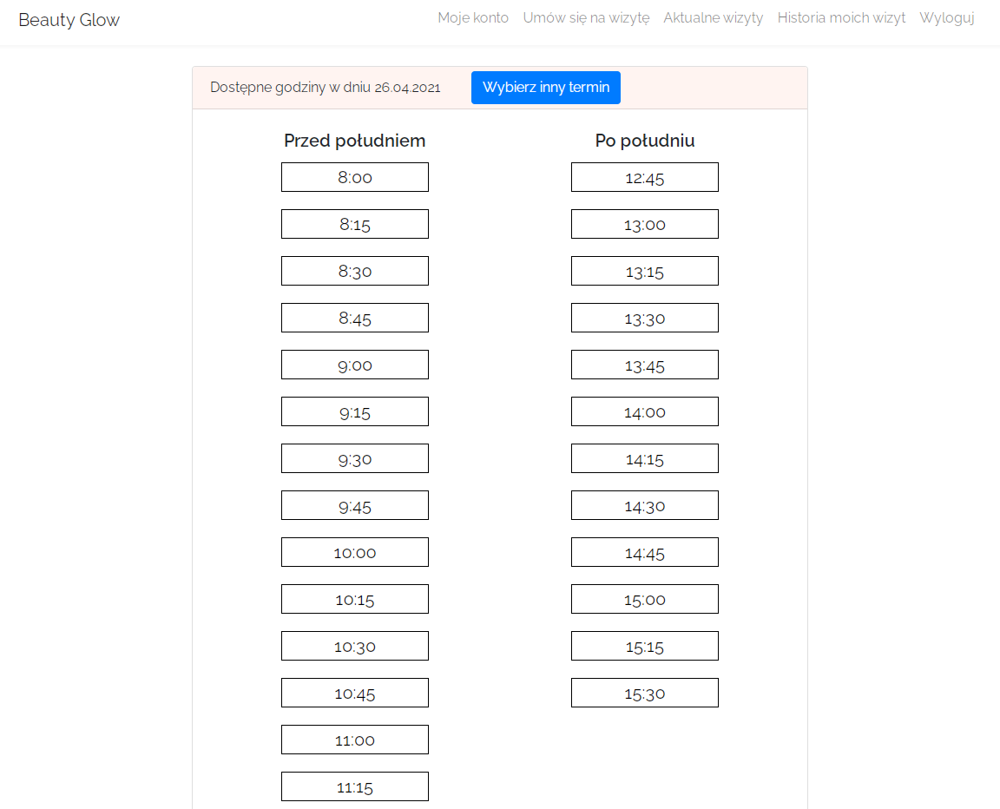
#### Confirm a visit
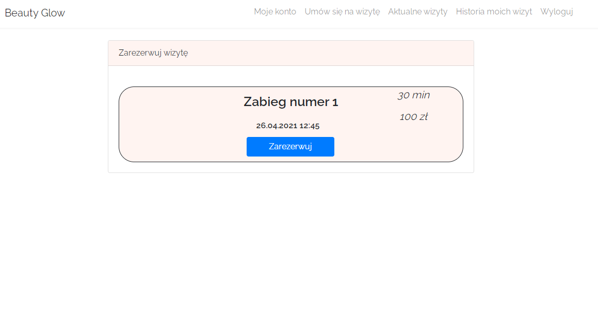
#### Administrator's Treatments List
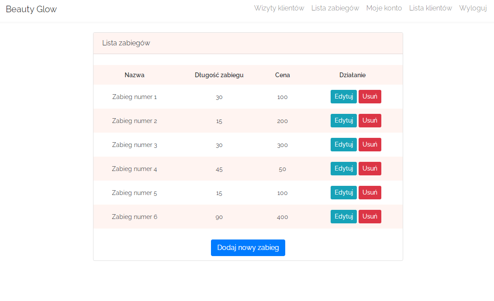
#### Administrator's Clients List
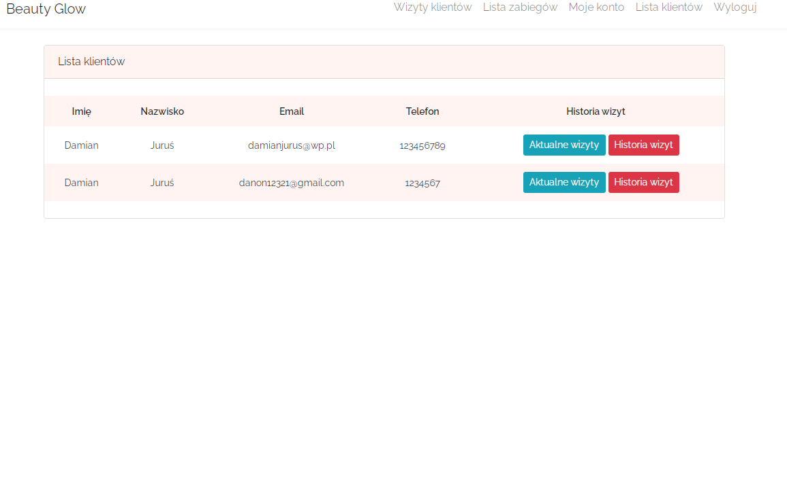
#### Administrator can check visits on specific day
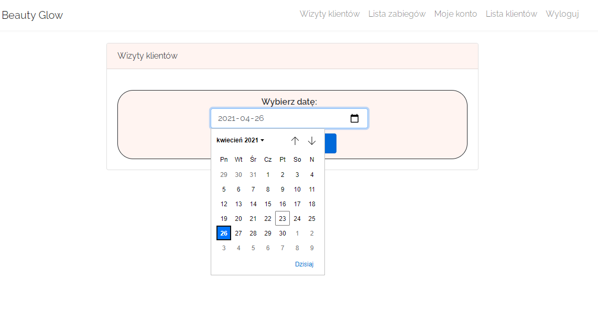
#### User visits on specific day
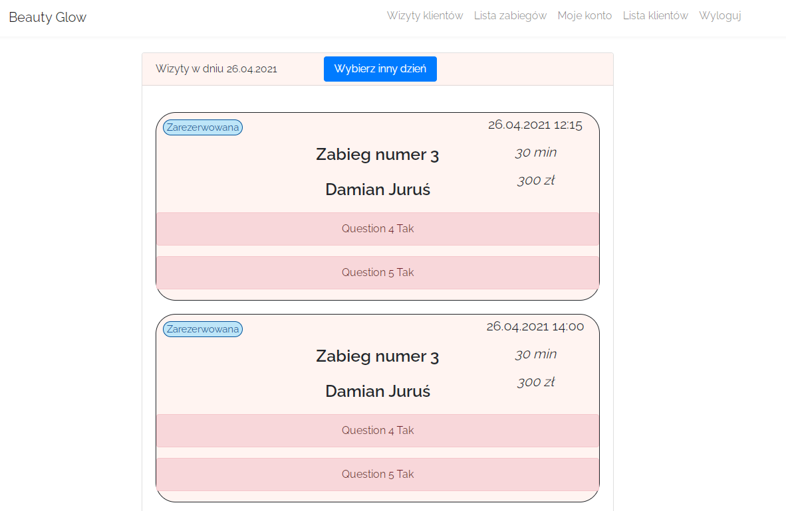
#### Entity Relationship Diagram
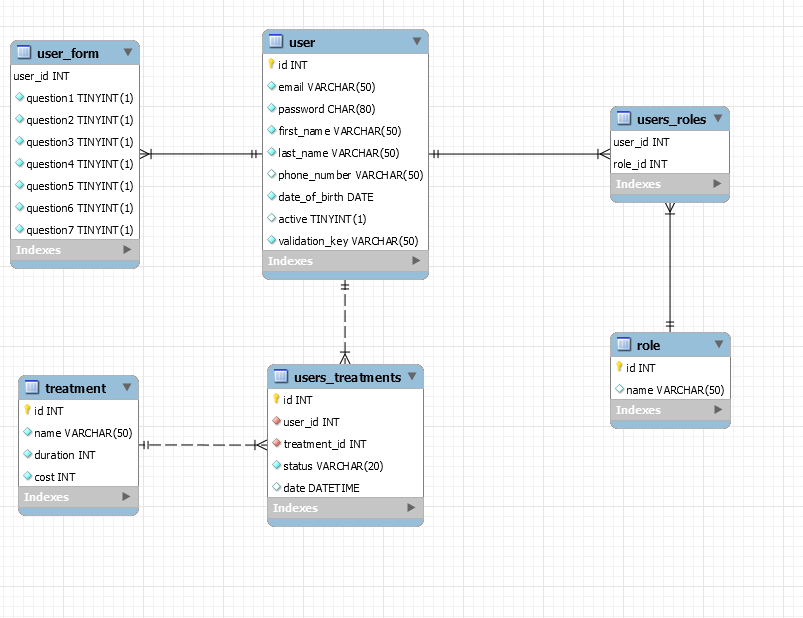

## Setup
Clone the repo from github:
```
$ git clone https://github.com/damian12321/beauty-glow
```
You can run the application on your favourite IDE by running src/main/java/pl/damian/beautyglow/BeautyGlowApplication.main
or by command line in the application root folder.

```
$ mvn clean package spring-boot:repackage
$ java -jar target/beauty-glow.jar
```

The app will start running at http://localhost:8080.
